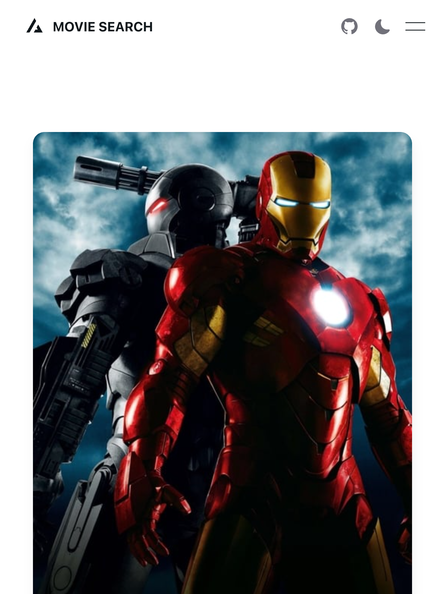

# Movie search app

This is a movie search app, that has search page, detail page, and add to watchlist functionality

## How to Use

### Setup env

Create an `.env.local` file and add `TMDB_API_KEY=<your-api-key>`

### Install dependencies

You can use one of them `npm`, `yarn`, `pnpm`, `bun`, Example using `npm`:

```bash
npm install
```

### Run the development server

```bash
npm run dev
```

### Prisma

Prisma is already added, migrations and db are already present.
No setup required for prisma.

### Demo




